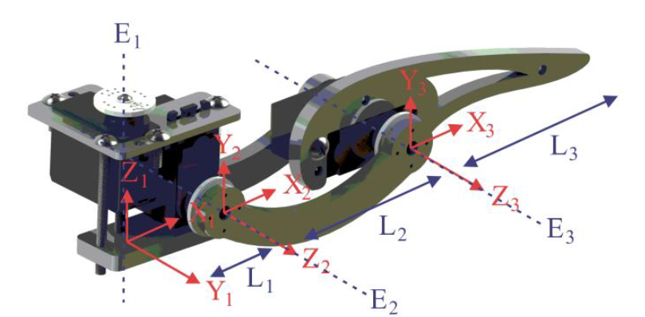

# Inverse Kinematics IP

## Introduction


## Hexapod Leg Inverse Kinematics Model


L1 = 0.0275 m\
L2 = 0.0963 m\
L3 = 0.1051 m\
E1 = Inverse Kinematics Parameter Q1\
E2 = Inverse Kinematics Parameter Q2\
E3 = Inverse Kinematics Parameter Q3


## Integration Guide
_Under construction._

## Numeric Format
Floating Point 32-bit Representation:\
Fixed-Point 20-bit Representation:\
Integer : 4-bit\
Decimal : 16-bit

## Inverse Kinematics IP Parameters
|Parameter|Value|Format|Comment|
|------|------|------|------|
|C_FIFO_DEPTH|16|Integer|FIFO Depth (This parameter will be fixed to 6 in upcoming versions)|
|C_FLP_WIDTH|32|Integer|Floating-Point data width|
|C_FXP_WIDTH|20|Integer|Fixed-Point data width|
|C_FXP_POINT|16|Integer|Fixed-Point decimal width|
|C_IKN_iK|'h09b74|Fixed-Point|Inverse of Circular-CORDIC K parameter in Fixed-Point Representation|
|C_IKN_iKH|'h3c370|Fixed-Point|Inverse of Hyperbolic-CORDIC Kh Parameter in Fixed-Point Representation|
|C_IKN_F|'h0ea90|Fixed-Point|
|C_IKN_C2|'hff1eb|
|C_IKN_C3|'hffafd|
|C_IKN_Ca8|'h62cd9|
|C_IKN_L1|'h0070a|
|C_IKN_nL1|'hff8f5|
|C_COR_ITER|16|Integer|Number of CORDIC Iterations|
|C_COR_N_ITER|1|Integer|Number of CORDIC negative Iterations|
|C_PWM_OFFSET|'h1921f|Not used in current release|
|C_PWM_SIZE|8|Integer|Servo PWM Resolution|
|C_PWM_FREQ|100|Integer|IP CLK Frequency used for PWM generation|
|C_PWM_MAX_IN|200|Integer|
|C_ROB_NLEGS|6|Integer|
|C_ROB_NJOINTS|3|Integer|

_Note: Some of these parameters will be set as local param in upcoming releases._

## Register Map
|ADDR|REG NAME|Comment|
|------|------|------|
|0x00|TRIG|Trigger Register|
|0x01|CTRL|Control Register|
|0x02|STAT|Status Register|
|0x03|LEGC|Leg Counter Register|
|0x04|IKIX|Inverse Kinematics Input X|
|0x05|IKIY|Inverse Kinematics Input Y|
|0x06|IKIZ|Inverse Kinematics Input Z|
|0x07|OF01|Digital Offset Q1|
|0x08|OF02|Digital Offset Q2|
|0x09|OF03|Digital Offset Q3|
|0x0A|OF04|Digital Offset Q4|
|0x0B|OF05|Digital Offset Q5|
|0x0C|OF06|Digital Offset Q6|
|0x0D|OF07|Digital Offset Q7|
|0x0E|OF08|Digital Offset Q8|
|0x0F|OF09|Digital Offset Q9|
|0x10|OF10|Digital Offset Q10|
|0x11|OF11|Digital Offset Q11|
|0x12|OF12|Digital Offset Q12|
|0x13|OF13|Digital Offset Q13|
|0x14|OF14|Digital Offset Q14|
|0x15|OF15|Digital Offset Q15|
|0x16|OF16|Digital Offset Q16|
|0x17|OF17|Digital Offset Q17|
|0x18|OF18|Digital Offset Q18|
|0x19|KO01|Leg 1 - Q1|
|0x1A|KO02|Leg 1 - Q2|
|0x1B|KO03|Leg 1 - Q3|
|0x1C|KO04|Leg 2 - Q1|
|0x1D|KO05|Leg 2 - Q2|
|0x1E|KO06|Leg 2 - Q3|
|0x1F|KO07|Leg 3 - Q1|
|0x20|KO08|Leg 3 - Q2|
|0x21|KO09|Leg 3 - Q3|
|0x22|KO10|Leg 4 - Q1|
|0x23|KO11|Leg 4 - Q2|
|0x24|KO12|Leg 4 - Q3|
|0x25|KO13|Leg 5 - Q1|
|0x26|KO14|Leg 5 - Q2|
|0x27|KO15|Leg 5 - Q3|
|0x28|KO16|Leg 6 - Q1|
|0x29|KO17|Leg 6 - Q2|
|0x2A|KO18|Leg 6 - Q3|

[_Detailed Register Map_](./register_map.md)
 
## Usage
- [Write Input FIFO](#Write-Input-Fifo)
- [Trigger Inverse Kinematics](#Trigger-Inverse-Kinematics)
- [Leg Counter Configuration](#Leg-counter-configuration)
- [Set Leg Joint Value Directly](#Set-leg-joint-value-directly)
- Output Fixed-Point to Floating-Point Convertion Read Mux

### Write Input FIFO
The first step of Inverse Kinematics Calculation is to write the Direct Kinematics Parameters into the FIFO through the IKIX, IKIY and IKIZ registers and writing 0b1 in the TRIG register. This operation will trigger the FIFO write operation.
- Implement Write FIFO function
```c
void write_fifo(float Input_X, float Input_Y, float Input_Z) {
    axi_write(BASE_ADDR+TRIG, 0b1);      // Write Direct Kinematics Input parameters into FIFO
    axi_write(BASE_ADDR+TRIG, 0b0);      // Not mandatory
}
```

- Write Calculation for one hexapod leg:
```c
float Input_X;
float Input_Y;
float Input_Z;
...
axi_write(BASE_ADDR+IKIX, *(uint32_t *) &Input_X);  // Direct Kinematics Input X
axi_write(BASE_ADDR+IKIY, *(uint32_t *) &Input_Y);  // Direct Kinematics Input Y
axi_write(BASE_ADDR+IKIZ, *(uint32_t *) &Input_Z);  // Direct Kinematics Input Z
write_fifo();
```

- Write Calculation for the six hexapod legs:
```c
float Input_X[6];
float Input_Y[6];
float Input_Z[6];
...
for(int i=0;i<6;<i++) {
    axi_write(BASE_ADDR+IKIX, *(uint32_t *) &Input_X[i]);  // Direct Kinematics Input X
    axi_write(BASE_ADDR+IKIY, *(uint32_t *) &Input_Y[i]);  // Direct Kinematics Input Y
    axi_write(BASE_ADDR+IKIZ, *(uint32_t *) &Input_Z[i]);  // Direct Kinematics Input Z
    write_fifo();
}
```

It is no necessary to write back to 0b0 the Triger FIFO Write bit in TRIG register after Direct Kinematics FIFO Write because this registers is Trigger Type, this means the FIFO Write operation is only performed on the AXI-Write operation on this register. But is it recomended since some AXI functions implemented in this project will re-write the current value of the IP registers and may cause unexpected behavioral.

### Trigger Inverse Kinematics
- Implement Trigger Inverse Kinematics Calculation Function
```c
void trigger_iKinematics() {
    axi_write(BASE_ADDR+TRIG, 0b2);      // Trigger Inverse Kinematics Calculation
    axi_write(BASE_ADDR+TRIG, 0b0);      // Not mandatory
}
```

- Trigger Inverse Kinematics Calculation for one hexapod leg:
```c
float Input_X;
float Input_Y;
float Input_Z;
...
axi_write(BASE_ADDR+IKIX, *(uint32_t *) &Input_X);  // Direct Kinematics Input X
axi_write(BASE_ADDR+IKIY, *(uint32_t *) &Input_Y);  // Direct Kinematics Input Y
axi_write(BASE_ADDR+IKIZ, *(uint32_t *) &Input_Z);  // Direct Kinematics Input Z
write_fifo();
trigger_iKinematics();
```

- Trigger Inverse kinematics Calculation for the six hexapod legs:
```c
float Input_X[i];
float Input_Y[i];
float Input_Z[i];
...
for(int i=0;i<6;<i++) {
    axi_write(BASE_ADDR+IKIX, *(uint32_t *) &Input_X[i]);  // Direct Kinematics Input X
    axi_write(BASE_ADDR+IKIY, *(uint32_t *) &Input_Y[i]);  // Direct Kinematics Input Y
    axi_write(BASE_ADDR+IKIZ, *(uint32_t *) &Input_Z[i]);  // Direct Kinematics Input Z
    write_fifo();
}
trigger_iKinematics();
```

### Leg Counter Configuration
LEGC Register controls the Hexapod Leg Pointer. This points to the hexapod leg where the next Inverse Kinematics calculation is assigned to. This register is composed by many configurations bits. These configurations can be done at the same axi transaction simultaneously.
See updated masks and bit offsets on [LEGC Register Details](register_map.md).

- Implement Leg Counter Configuration Function
```c
void leg_ctr_config(uint32_t counter_mode, uint32_t select_leg) {
    const uint32_t counter_mode_mask   = 0x30; 
    const uint32_t counter_mode_offset = 4;
    const uint32_t select_leg_mask     = 0x7;
    const uint32_t select_leg_offset   = 0;
    const uint32_t select_leg_trig     = 0x8;
    const uint32_t mask = counter_mode_mask + select_leg_mask + select_leg_trig;
    counter_mode = (counter_mode << counter_mode_offset) & counter_mode_mask;  // Set Leg Counter mode and shift offset 
    select_leg   = ((select_leg << select_leg_offset) & select_leg_mask) + select_leg_trig;  // Set Leg Counter to a leg value
    axi_write_mask(BASE_ADDR+LEGC, counter_mode+select_leg, mask); 
}
```

### Set Leg Joint Value Directly
- Implement Set Leg Joint Directly Function
```c
void set_joint_direct(uint32_t leg, float Init_X, float Init_Y, float Init_Z) {
    leg_ctr_cfg(0x10, leg);
    axi_write(IKQ1, Init_X);
    axi_write(IKQ2, Init_Y);
    axi_write(IKQ3, Init_Z);
    axi_write(TRIG, 0x4);
    axi_write(TRIG, 0);
}
```

### Initialize Joint Digital Offsets
- Initialize Joint Digital Offsets
```c
float joint_offset[18];
...
for (int=i; i<18; i++) {
    axi_wrie(OF01+i, *(uint32_t *) &joint_offset[i]);
}
```
